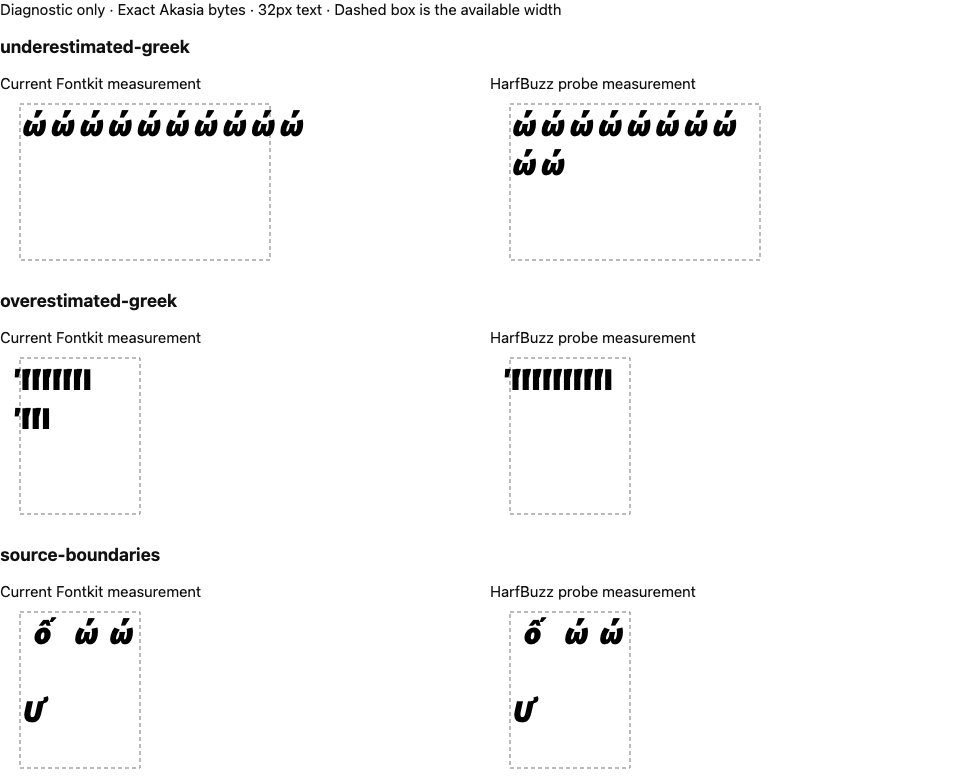

# Akasia shaping and wrapping evidence

This Node 24 milestone reproduces a font-measurement defect and demonstrates a
source-preserving shaping correction in a test-only adapter. The production
Fontkit registry, font bytes, font mappings, package versions and websites are
unchanged. Native Office recovery and font compatibility remain separate gates.

## Observations

The matrix contains 357 canonical composition/decomposition pairs per style:
8,568 specimens across all twelve hash-verified Akasia v0.0.2 faces. Fontkit
2.0.4 has 460 advance differences at or above the existing 0.1px threshold,
all in decomposed inputs. The maximum is 5.203125px at 32px text. No threshold
was relaxed. These are complete eligible cmap pairs, not complete language,
script, shaping-feature or font compatibility coverage.

`uharfbuzz` 0.56.1 and `harfbuzzjs` 1.6.1 both report HarfBuzz 14.4.0. Their
glyph IDs, clusters, advances and offsets match on every matrix specimen.
The JavaScript model also matches between Node and Chromium, including its
computed glyph extents. Separately measured Chromium SVG advances match
HarfBuzz exactly for every specimen. Browser/network/runtime versions and
exact local asset hashes are in the reports.

The retained trace for Black Italic `o + U+0302 + U+0301` shows composition
inside HarfBuzz before GSUB. The authored string is never normalized. Test
fixture generation explicitly labels composed and decomposed inputs; neither
form replaces the other in a document.

The actual core `fitText` API demonstrates two layout consequences:

- Ten accented Greek omegas at 32px measure 233.90625px in Fontkit, so the
  current callback accepts one line in a 250px box. Chromium renders an advance
  of 285.9375px. The HarfBuzz callback accepts two lines of 228.75px and
  57.1875px, matching their actual browser advances.
- Ten accented capital Greek iotas need 102.96875px in a 120px box. Fontkit's
  overestimate creates two lines; the HarfBuzz callback correctly retains one.
- A separate mixed-ending/whitespace fixture keeps exact source ranges, tabs,
  blank lines, trailing spaces and original accents at the fixed 32px floor.



The screenshot was inspected at full size. It shows the original omega overrun
and corrected wraps, and also visible left side-bearing overhang on the iota.
The boxes here test advances; they do not establish ink containment, polished
slide design, native raster parity or full editor/export acceptance. Do not use
these results as an Aptos compatibility claim or a production backend release.

## Verification and reproduction

Run the independent retained-data verifier without fonts, browser, Python or
HarfBuzz installed:

```sh
node docs/evidence/akasia-shaping-20260914/verify.mjs
```

It verifies evidence hashes, matrix identities and counts, exact text and
cross-binding glyph results, reported deltas, the preserved current failure,
corrected browser widths, source/grapheme boundaries and trace composition.
It does not rerun a browser or infer native fidelity from stored results.

The [portable probe](../../../scripts/font-shaping-probe/README.md) explains
how to regenerate observations using the original fonts and pinned tools.
`manifest.json` binds the runtime source heads, relevant files, probe code,
font records, package integrity and environment. The Python installation
report records its downloaded wheel and hash. No proprietary or open font
binaries, WASM binaries, node_modules or Python environment are committed here.

`browser-whitespace-harness-failure.json` and its log retain the first browser
check's failure: the measurement node collapsed spaces, yielding a zero space
width and invalid tab measurement. The harness now explicitly preserves SVG
whitespace and rejects nonfinite measurements. That failure did not justify
changing authored whitespace or weakening any measurement threshold. Its JSON
was reserialized with escapes for the repository's text-integrity scanner;
parsed values are unchanged. The accepted report is `browser-matrix.json`.

The [runtime integration plan](../../plans/font-shaping.md) records remaining
format, lifecycle, offline packaging, multilingual, corpus, editing/export and
native requirements. The overall ecosystem goal remains active.
