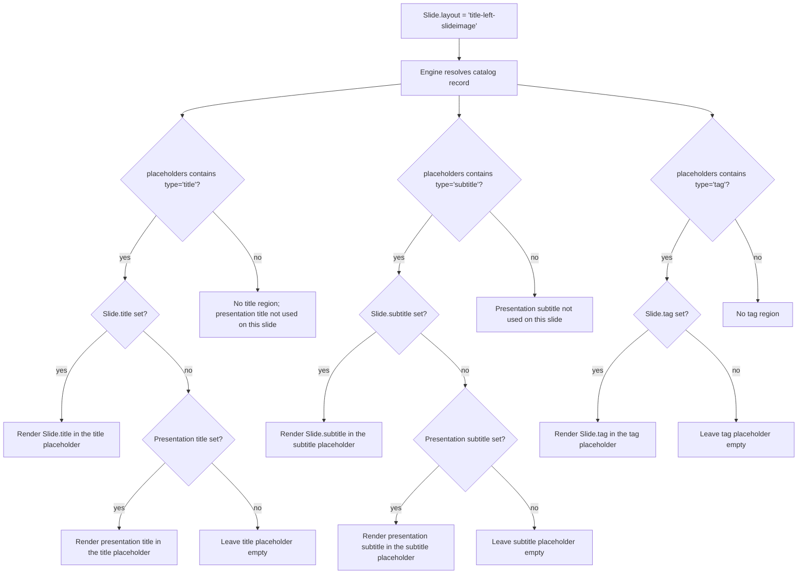

# Folding layout placeholders into the OPF layout schema

Plan for adding a `placeholders` field to [`spec/schemas/layout.schema.json`](../../spec/schemas/layout.schema.json), regenerating the 400 per-layout JSONs in [`spec/catalogs/layouts/`](../../spec/catalogs/layouts/) from the database extract at [`spec/catalogs/layouts/extract/`](../../spec/catalogs/layouts/extract/), and making the `title` / `subtitle` defaulting promise in [`opf.schema.json:49,62`](../../spec/schemas/opf.schema.json) achievable end-to-end.

## Executive summary — key decisions

1. **Add `placeholders: Placeholder[]` to the layout schema.** Each entry is just `{ type }`. The array order is the source of truth for ordering multiple placeholders of the same type — no slot strings, no index fields.

2. **Type vocabulary is OPF-semantic, ten values:** `title`, `subtitle`, `tag`, `body`, `chart`, `picture`, `table`, `media`, `diagram`, `code`. `body` is the workhorse — it maps to PowerPoint's generic `OBJECT` placeholder and ordinary `BODY` regions, and can host any content item kind. The named kinds describe specific content roles (small label/badge, chart, image, table, video/audio, smartart, source code) so pickers and AI generation can target them precisely. The current extract only carries rows for `OBJECT/BODY/CHART/PICTURE` plus chrome — `tag`, `table`, `media`, `diagram`, and `code` are forward-looking vocabulary the migration script does not synthesize today (`tag` is gated on the existing-but-unused `slideTag` schema boolean and synthesizes the moment data lands, same pattern as `title`/`subtitle`).

3. **Chrome stays out of `placeholders`.** `slide-number` / `footer` / `date` are not main slide slots — they're deck-level header/footer furniture already owned by `Design.header` / `Design.footer` ([`opf.schema.json:558-575`](../../spec/schemas/opf.schema.json)). Don't mix the two.

4. **Do not add a chrome or bleed field.** Chrome stays in `Design.header` / `Design.footer`, and canvas behavior is represented by canonical layout ids such as `image-bleed` / `blank` plus their placeholder lists, not by a separate `bleed` property.

5. **Binding rules:** `title`, `subtitle`, and `tag` placeholders bind to first-class slide fields (`Slide.title`, `Slide.subtitle`, `Slide.tag`). `content[].slot` is for the remaining placeholders (`"body"`, `"chart"`, `"picture"`, …). When multiple placeholders share a type, multiple content items with the same `slot` value bind to them in array order. `ContentItem.slot` description and examples in [`opf.schema.json`](../../spec/schemas/opf.schema.json) get a small companion update to match.

6. **Title synthesis:** 242 layouts have `slide_title=true` but no `TITLE` placeholder in the extract. The migration script inserts `{ type: "title" }` at index 0 of `placeholders` for each.

7. **Subtitle synthesis:** 4 cover-style Title-content layouts (`title-left-box`, `title-center-box`, `title-left-slideimage`, `title-center-slideimage`) carry an extra `BODY` placeholder in the extract that visually serves as a subtitle. Retype it to `{ type: "subtitle" }` and set `slideSubtitle: true` on those four records. No new layouts in this pass.

8. **OOXML round-trip is out of scope.** This pass is about getting the OPF semantic model right. `title` vs `ctrTitle`, how `body` maps to `<p:ph type="obj">` vs other variants, whether `picture` becomes `<p:ph type="pic">` or a fill — all renderer concerns, addressed when the .pptx render path lands.

9. **Bulk regeneration is safe.** All 400 per-layout JSONs are 1:1 deterministic projections of the extract row (verified: 1 distinct key shape across all 400). A migration script can replace them en masse. The "drift" is a single file: [`spec/catalogs/layouts/index.json`](../../spec/catalogs/layouts/index.json) is the catalog index, not a layout record.

10. **Layout taxonomy refactor is a future pass.** The `-box`, alignment (`-left` / `-center`), and `-slideimage` modifiers are stylistic / design properties, not content-shape properties — they could collapse into design overrides rather than distinct layout records. Out of scope here; flagged as follow-on so the placeholder work doesn't get blocked on it.

---

## 1. Findings

### 1.1 Counts

- 400 records in [`spec/catalogs/layouts/extract/layout.json`](../../spec/catalogs/layouts/extract/layout.json).
- 5,664 records in [`spec/catalogs/layouts/extract/placeholder.json`](../../spec/catalogs/layouts/extract/placeholder.json).
- 401 files in [`spec/catalogs/layouts/`](../../spec/catalogs/layouts/), all conforming to the layout schema except [`spec/catalogs/layouts/index.json`](../../spec/catalogs/layouts/index.json), which uses `https://openpresentation.org/schema/opf-layout-index/v1`. **Drift is 1 file (the index), not 2.**
- All 400 per-layout files have the **exact same key shape** (1 distinct shape across 400 files), with no `description`, `summary`, `tags`, or `preview` content. **Zero hand-curated data** — bulk regeneration is safe.
- `rg '"slideSubtitle"' spec/catalogs/layouts` → 0 hits. The schema field at [`spec/schemas/layout.schema.json:192-198`](../../spec/schemas/layout.schema.json) is unused by every record.

### 1.2 Placeholder type frequencies (extract vocabulary)

| extract type    | count | meaning |
| --------------- | ----- | ------- |
| `OBJECT`        | 4,004 | PowerPoint generic Placeholder — flexible content holder (text / chart / image / smartart / etc). |
| `SLIDE_NUMBER`  | 356   | Slide-number chrome. |
| `DATE_AND_TIME` | 356   | Date chrome. |
| `FOOTER`        | 356   | Footer chrome. |
| `BODY`          | 315   | Body text region (caption, list-intro, subtitle on cover layouts — see §1.6). |
| `PICTURE`       | 211   | Image region. |
| `CHART`         | 66    | Chart region. |

No `TITLE` or `SUBTITLE` records. The title region is captured only by the layout-level `slide_title: true` boolean.

### 1.3 Chrome is strictly all-or-nothing

| | layouts |
| --- | --- |
| Has all three chrome placeholders (`SLIDE_NUMBER` + `DATE_AND_TIME` + `FOOTER`) | 356 |
| Has none of them | 44 |
| Has a partial subset | **0** |

The 44 no-chrome layouts are *exactly* the 44 `Image_Only_*` records, and every one of them has **zero placeholders total**. They motivate the later canonical `image-bleed` / `blank` taxonomy, not a field on each layout record.

### 1.4 `OBJECT` count vs `content_multiple` (cross-tab)

| content_multiple | O=0 | O=3 | O=4 | O=5 | O=6 | O=7 | O=8 | O=10 | O=13 | O=16 | O=19 | O=22 | O=24 |
| ---------------- | --- | --- | --- | --- | --- | --- | --- | ---- | ---- | ---- | ---- | ---- | ---- |
| `None`           | 0   | 0   | 12  | 0   | 0   | 0   | 0   | 0    | 0    | 0    | 0    | 0    | 0    |
| `1x`             | 12  | 4   | 23  | 0   | 8   | 37  | 0   | 0    | 0    | 0    | 0    | 0    | 0    |
| `2x`             | 16  | 0   | 0   | 6   | 0   | 25  | 8   | 37   | 0    | 0    | 0    | 0    | 0    |
| `3x`             | 16  | 0   | 0   | 0   | 0   | 10  | 0   | 39   | 37   | 0    | 0    | 0    | 0    |
| `4x`             | 0   | 0   | 0   | 0   | 0   | 0   | 0   | 0    | 15   | 21   | 0    | 0    | 0    |
| `5x`             | 0   | 0   | 0   | 0   | 0   | 0   | 0   | 0    | 0    | 15   | 21   | 0    | 0    |
| `6x`             | 0   | 0   | 0   | 0   | 0   | 0   | 0   | 0    | 0    | 0    | 15   | 21   | 2    |

`OBJECT` count grows with `content_multiple`, `slide_title`, and `content_box` but no closed-form rule fell out — best treated as opaque per-layout data and stored verbatim. (See open question §4.1 for the `content`-array-order semantic decoding.)

### 1.5 `CHART` and `PICTURE` are clean

- For chart layouts: `CHART` count == the integer in `content_multiple` (6×1 + 6×2 + 16×3 = 66 ✓).
- For image-content layouts: `PICTURE` count tracks `slide_image` (1) and the content-image case for `cm=1x` (1).
- `Image_Only_*` layouts have 0 `PICTURE` placeholders — those layouts position the image directly without a `<p:ph>`.

### 1.6 `BODY` on Title-content layouts is the implicit subtitle

Among the 12 Title-content layouts, exactly 4 carry a `BODY` placeholder:

| layout | content_box | slide_image_alignment | BODY |
| ------ | ----------- | --------------------- | ---- |
| `title-left-box`           | true   | None       | **1** |
| `title-center-box`         | true   | None       | **1** |
| `title-left-slideimage`    | false  | Background | **1** |
| `title-center-slideimage`  | false  | Background | **1** |

Pattern: `BODY` appears on a Title-content layout iff `content_box=true` OR `slide_image_alignment=Background` — these are the cover-style layouts where supporting copy makes sense. **No subtitle data needs to be invented; it can be reinterpreted from these 4 existing `BODY` placeholders.**

### 1.7 Title synthesis target

242 layouts have `slide_title=true` (12 `Title` + 36 `Text` + 18 `Number` + 48 `Image` + 18 `Chart` + 110 `List`) and need a synthesized `title` placeholder. The other 158 don't carry a title region.

### 1.8 Extract ordering

Within each layout, placeholders are listed by ascending `id`. The shape is:

1. `PICTURE` (when present)
2. Chrome trio: `SLIDE_NUMBER`, `DATE_AND_TIME`, `FOOTER` (when present)
3. `OBJECT` / `BODY` / `CHART` interleaved, in master-deck insertion order

Whether step 3 is z-order, tab order, or insertion order is unknown without inspecting the source `.pptx`. The script preserves extract order verbatim — that's the only choice that round-trips.

---

## 2. Proposal

### 2.1 Type vocabulary (eleven OPF-semantic values)

| OPF type    | Extract source     | `ContentItem.type` | Notes |
| ----------- | ------------------ | -------------- | ----- |
| `title`     | *(synthesized)*    | `text`         | One per layout with `slide_title=true`. At most one per layout by convention. |
| `subtitle`  | `BODY` (retyped)   | `text`         | Only on the 4 cover layouts in §1.6. At most one per layout by convention. |
| `tag`       | *(synthesized when `slide_tag=true`; no records have it today)* | `text` | Small slide-level label/badge region above or near the title. The `slideTag` boolean already exists on the layout schema ([`spec/schemas/layout.schema.json:176-183`](../../spec/schemas/layout.schema.json)) but is unused by every record — same situation `slideSubtitle` was in. At most one per layout by convention. |
| `body`      | `BODY` / `OBJECT`  | (any)          | Generic body/content region; hosts text / chart / image / smartart / etc. |
| `chart`     | `CHART`            | `chart`        | |
| `picture`   | `PICTURE`          | `image`        | |
| `table`     | *(forward-looking)* | `table`       | No extract rows today; reserved for layouts that expose a dedicated table region. |
| `media`     | *(forward-looking)* | `video`       | No extract rows today; reserved for layouts that expose a video / audio region. |
| `diagram`   | *(forward-looking)* | (none yet)    | No extract rows today and no matching `ContentItem.type` yet (no SmartArt item in OPF). Vocabulary placeholder for future layouts. |
| `code`      | *(forward-looking)* | `code`        | No extract rows today; PowerPoint has no native code placeholder type, so a `code` slot would be an OPF-only convention for layouts that intentionally reserve a code region. |

`title` and `subtitle` map to extract rows today (synthesized and BODY-retyped, respectively); `body`, `chart`, and `picture` map directly. The remaining five (`tag`, `table`, `media`, `diagram`, `code`) are vocabulary the schema declares but the migration script does not synthesize on the current extract. Authors can hand-curate them via `extract/overrides.json` (§3.1); `tag` will start synthesizing automatically once any layout record gets `slide_tag=true` (same gating pattern as `title` ↔ `slideTitle` and `subtitle` ↔ `slideSubtitle`).

**Chrome (`SLIDE_NUMBER`, `DATE_AND_TIME`, `FOOTER`) is intentionally not a placeholder type.** Chrome is deck-level furniture, owned by `Design.header` / `Design.footer` ([`opf.schema.json:558-575`](../../spec/schemas/opf.schema.json)) and rendered by the engine independently of layout content.

### 2.2 Binding rules

The `placeholders` array is the source of truth for ordering. Slots are not separately named. `title`, `subtitle`, and `tag` placeholders bind to the matching slide fields; other placeholder types bind through `content[].slot`.

Binding algorithm:

1. Group the layout's `placeholders` by `type`, preserving array order within each group.
2. Fill singleton text placeholders from `Slide.title`, `Slide.subtitle`, and `Slide.tag`. If `Slide.title` or `Slide.subtitle` is omitted, fall back to the presentation-level `title` / `subtitle`.
3. For each content item on the slide, take its `slot` value as a placeholder type.
4. Walk content items in slide order; bind each to the next unbound placeholder of that type. (Multiple items with the same `slot` value fill consecutive same-typed placeholders.)

Examples:

- A layout with `[{type:"title"},{type:"body"},{type:"body"},{type:"body"}]` and three content items with `slot:"body"` → first item fills `placeholders[1]`, second fills `[2]`, third fills `[3]`.
- A chart item with `slot:"body"` on the same layout → fills the first available `body` placeholder; the placeholder is generic (`OBJECT` / PowerPoint Placeholder), so any content item kind is accepted.
- Singletons (`title`, `subtitle`, `tag`): filled from `Slide.title`, `Slide.subtitle`, and `Slide.tag` because each appears at most once per layout.

`ContentItem.slot` in [`opf.schema.json`](../../spec/schemas/opf.schema.json) gets a companion update in Phase 1: the description switches to say `Slide.title` / `Slide.subtitle` / `Slide.tag` own those common text placeholders, while `slides[].content` items bind the remaining placeholders. The `image-right` / `footer` examples (which don't fit the new vocabulary) get replaced with `body`, `chart`, `picture`, `table`, `media`, `diagram`, and `code`.

If a future use case needs to bind to a specific position within a same-typed group ("fill only the third body slot"), the cheapest extension is an optional `ContentItem.slotIndex: integer` (1-based). Deferred until that use case appears — the array-order rule covers everything we need today.

### 2.3 Schema addition to `spec/schemas/layout.schema.json`

```jsonc
{
  "placeholders": {
    "type": "array",
    "items": { "$ref": "#/$defs/Placeholder" },
    "description": "Ordered slots the layout exposes, in the order they appear in the underlying slide-layout. The engine fills 'title', 'subtitle', and 'tag' placeholders from Slide.title, Slide.subtitle, and Slide.tag. Slide content binds through root payload fields or promoted region keys. Chrome — slide number, footer, date — is NOT included here; it is owned by Design.header / Design.footer."
  }
}

"$defs": {
  "Placeholder": {
    "type": "object",
    "required": ["type"],
    "description": "A single slot inside a slide layout. Title, subtitle, and tag placeholders bind to the corresponding Slide fields; other placeholders bind to slide content items by matching content[].slot to the placeholder type. The array order in the surrounding 'placeholders' field disambiguates multiple placeholders of the same type.",
    "properties": {
      "type": {
        "type": "string",
        "enum": ["title", "subtitle", "tag", "body", "chart", "picture", "table", "media", "diagram", "code"],
        "description": "OPF placeholder kind. 'body' is the generic flexible slot (PowerPoint's standard Placeholder), capable of hosting any content item type. The named kinds describe a specific content role used by pickers, AI generation, and engine defaulting: 'title' / 'subtitle' / 'tag' / 'body' for text regions ('tag' is a small label/badge above or near the title), 'chart' / 'picture' / 'table' for typed visual regions matching their ContentItem.type, 'media' for video and audio, 'diagram' for SmartArt-style graphics, 'code' for source-code regions."
      }
    }
  }
}
```

Companion update to [`opf.schema.json`](../../spec/schemas/opf.schema.json) — `Slide.title`, `Slide.subtitle`, and `Slide.tag` become first-class slide fields, and `ContentItem.slot`'s description/examples align with the placeholder binding rule (§2.2). The unused `slideSubtitle` field also gets a real meaning: `true` exactly when `placeholders` contains a `subtitle` entry — i.e. the 4 cover layouts in §1.6.

### 2.4 Subtitle synthesis decision

**Reinterpret the existing `BODY` placeholder on the 4 cover-style Title layouts as `subtitle`. Do not invent new layouts in this pass.**

Affected layouts: `title-left-box`, `title-center-box`, `title-left-slideimage`, `title-center-slideimage`. Their visual contract becomes:

```
slot=title    → Slide.title, falling back to presentation title
slot=subtitle → Slide.subtitle, falling back to presentation subtitle
```

The other 8 Title-content layouts stay subtitle-less. Authors who need a subtitle on, say, `title-left-slideimage-bottom`, pick one of the 4 subtitle-bearing layouts.

Trade-offs:
- **Why not new `cover-*` layouts:** zero new records to design, zero churn to existing ids. The visual change is "this `BODY` was already rendered — we're just naming it."
- **Why not retype `BODY` on non-Title layouts (Image, Chart, Number, Text, List) too:** `BODY` on those layouts is contextually a caption / list-intro / supporting paragraph — not a subtitle. Reinterpreting all 315 `BODY` rows would over-promise `subtitle` defaulting and confuse pickers.

### 2.5 Canvas layouts

The 44 `Image_Only_*` extract records motivate the canonical `image-bleed` and `blank` layouts in [`layout-taxonomy.md`](layout-taxonomy.md). They do not require a field on the layout schema. Canvas behavior is expressed by the canonical layout choice and the layout's placeholder list (`image-bleed` has a `picture` placeholder; `blank` has none).

### 2.6 `Slide.title` / `Slide.subtitle` / `Slide.tag` defaulting end-to-end



This makes the promise in [`opf.schema.json:49`](../../spec/schemas/opf.schema.json) ("on slides whose layout exposes a 'title' placeholder, the engine fills that placeholder with this value when the slide does not define its own title") mechanically checkable: the engine inspects `placeholders` directly.

---

## 3. Migration script

### 3.1 Inputs / outputs

- **Path:** `scripts/regenerate-layouts.mjs` (new). Node, ESM, no external deps.
- **Inputs:**
  - `spec/catalogs/layouts/extract/layout.json` — 400 records.
  - `spec/catalogs/layouts/extract/placeholder.json` — 5,664 records.
  - `spec/catalogs/layouts/extract/overrides.json` *(new, optional, default `{}`)* — escape hatch keyed by layout id, deep-merged into the generated record. Empty for the initial regeneration; required only if a hand-curated field needs to survive in the future.
- **Outputs:**
  - 400 files in `spec/catalogs/layouts/<id>.json`.
  - `spec/catalogs/layouts/index.json` regenerated from the same data so it stays in sync.

### 3.2 Algorithm (pseudocode)

```text
load layouts[] from extract/layout.json
load placeholders[] from extract/placeholder.json
load overrides{} from extract/overrides.json (default {})

phByLayout = group placeholders by layout_id, preserving id-ascending order

for each L in layouts:
  id  = nameToId(L.name)            // Title_Left -> title-left
  phs = phByLayout[L.id] ?? []

  # 1. Filter chrome out — it's deck-level, not layout-content.
  contentPhs = phs.filter(p =>
    p.type !== 'SLIDE_NUMBER' &&
    p.type !== 'DATE_AND_TIME' &&
    p.type !== 'FOOTER')

  # 2. Translate extract types -> OPF types, with subtitle reinterpretation
  #    for the 4 cover layouts.
  isTitleCover = (L.content_type === 'Title') &&
                 contentPhs.some(p => p.type === 'BODY')

  translated = []
  let bodySeen = 0
  for p in contentPhs:
    if p.type === 'BODY' and isTitleCover and bodySeen === 0:
      translated.push({ type: 'subtitle' })   // first BODY on Title cover -> subtitle
      bodySeen++
    else:
      translated.push({ type: extractTypeToOpfType(p.type) })
        // OBJECT->content, BODY->body, CHART->chart, PICTURE->picture

  # 3. Synthesize 'title' at index 0 when slide_title=true.
  if L.slide_title:
    translated.unshift({ type: 'title' })

  # 3b. Synthesize 'tag' at index 0 when slide_tag=true. No extract rows
  #     have this today; the branch is a no-op on the current data and
  #     activates automatically once 'slide_tag' starts being set.
  #     Tag goes BEFORE title in the placeholders list since it's a
  #     small label rendered above/near the title.
  if L.slide_tag:
    translated.unshift({ type: 'tag' })

  # 4. The translated array IS the final placeholders array — no slot
  #    assignment step. Multiple placeholders of the same type are
  #    disambiguated purely by array order.
  placeholders = translated

  # 5. Build the final record.
  record = {
    "$schema": "https://openpresentation.org/schema/opf-layout/v1",
    id,
    name: titleCaseFromName(L.name),       // Title_Left -> "Title Left"
    placeholders,
  }

  record = deepMerge(record, overrides[id] ?? {})

  write spec/catalogs/layouts/{id}.json with record (sorted keys, 2-space indent,
        trailing newline — match existing file style)

# Regenerate index.json with the same wrapper used today
indexRecords = layouts
  .map(L => ({ id: nameToId(L.name),
               name: titleCaseFromName(L.name),
               file: `${nameToId(L.name)}.json` }))
  .sort((a, b) => a.id.localeCompare(b.id))
write spec/catalogs/layouts/index.json
```

### 3.3 Automated vs human review

**Fully automated (no review):**
- Extract → record projection (already 1:1 deterministic per §1.1).
- Title synthesis for the 242 layouts with `slide_title=true`.
- Chrome filtering and type translation (`OBJECT`→`content`, `BODY`→`body`, etc.).
- `index.json` regeneration.

**Needs human eyeball on first run:**
- Diff the generated files against current files; the layout records should only carry `$schema`, `id`, `name`, and `placeholders`.
- Confirm the 4-layout subtitle reinterpretation list (`title-left-box`, `title-center-box`, `title-left-slideimage`, `title-center-slideimage`) is the intended set.

### 3.4 Validation

1. `node packages/javascript/scripts/generate.mjs` to regenerate TS types from the new schema.
2. Validate every `spec/catalogs/layouts/*.json` against `spec/schemas/layout.schema.json`.
3. Spot-check counts in the regenerated files: `rg '"type": "title"' spec/catalogs/layouts | wc -l` and `rg '"type": "subtitle"' spec/catalogs/layouts | wc -l` should match the expected generated catalog shape.

---

## 4. Risks / open questions

1. **`body` ordering is opaque.** When a layout has multiple `body` placeholders, an author writing `slot: "body"` on multiple content items gets them filled in array order, but until OOXML inspection of the source `.pptx` is done we can't promise *which* visual region each array slot is (heading vs body vs caption). Treat array order as a positional binding for v1 and refine in a follow-on pass once the `.pptx` source decks are inspected.

2. **`PICTURE` vs `slide_image` overlap.** A layout like `Image_1x_Crop` carries 1 `PICTURE` for the content image; `Title_Left_SlideImage` carries 1 `PICTURE` for the slide-level image. Both end up as a single `picture` placeholder in the generated record, and authors bind via `slot: "picture"` in either case. If a future use case needs to distinguish "the content image" from "the slide-level background image," the cheapest extension is a separate placeholder type (e.g. `slide-image`) — not needed today.

3. **List-layout `BODY` split.** 91 of 182 list layouts have a single `BODY`, 91 don't, and the split doesn't correlate with any extract field I checked (`content_type_list_bullet`, `content_type_list_heading`). The script faithfully includes a `body` placeholder for the half that have it; downstream code shouldn't assume List layouts have or don't have a `body` slot. Worth revisiting alongside any list data-model rework.

4. **Layout taxonomy refactor (separate plan).** The `-box`, alignment (`-left` / `-center`), and `-slideimage` modifiers in layout names are really *design* properties — a box behind the content, the title's horizontal alignment, a full-bleed image overlay. They could be expressed as design overrides on a much smaller base set of layouts (~23 canonical layouts vs the current 400). Spec'd out in [`layout-taxonomy.md`](layout-taxonomy.md) as a follow-on plan; the placeholder list this plan introduces is design-agnostic and survives that taxonomy rework verbatim.

5. **List data model.** The presentation schema now uses `ContentItem.type = "list"` plus a flat `list` array, keeping list semantics on the content item rather than encoding them in the layout. The current layout schema's `contentTypeListBullet` and `contentTypeListHeading` booleans remain coarse design/catalog hints and should be revisited separately.

6. **Source `.pptx` sanity check (when convenient).** The 400-layout source `.pptx` exists but is out of scope for this pass. When the .pptx render path is built, spot-check 5–10 layouts to confirm:
   - the array order of `body` placeholders matches the visual ordering authors expect,
   - `PICTURE`-vs-`OBJECT` splits in image layouts behave as predicted,
   - canvas-layout chrome suppression for `image-bleed` / `blank` matches what designers want.

---

## 5. Phased rollout

Each phase leaves the repo in a valid state.

### Phase 1 — Schema additions (additive, low risk)

- Add `Placeholder` `$def` and the `placeholders` property to [`spec/schemas/layout.schema.json`](../../spec/schemas/layout.schema.json) as an optional field.
- Update the `slideSubtitle` description to say "true exactly when `placeholders` contains a `subtitle` entry."
- Add `Slide.title`, `Slide.subtitle`, and `Slide.tag` to [`spec/schemas/opf.schema.json`](../../spec/schemas/opf.schema.json), and update `ContentItem.slot` so its description/examples focus on the remaining placeholder vocabulary (`body`, `chart`, `picture`, `table`, `media`, `diagram`, `code`).
- Run `node packages/javascript/scripts/generate.mjs` to regenerate TS types.
- All 400 existing `spec/catalogs/layouts/*.json` records still validate (the new fields are optional).

### Phase 2 — Migration script + dry-run diff

- Land `scripts/regenerate-layouts.mjs` and run with `--dry-run` (write to a sibling temp dir).
- Diff: should be a clean addition of `placeholders` on the generated layout records.
- Reviewers sign off on the 4-layout subtitle list.

### Phase 3 — Bulk regeneration

- Run the script for real, replacing all 400 `spec/catalogs/layouts/*.json` files and `spec/catalogs/layouts/index.json`.
- Re-run TS-type generation.
- Validation queries from §3.4.

### Phase 4 — Engine implementation of `title` / `subtitle` defaulting

- Implement the resolution algorithm in §2.6 in whichever package owns layout resolution.
- Add a fixture OPF document that sets only `title` + `subtitle` and a slide with `layout: "title-left-slideimage"` and **no content**, and assert both strings render.
- Counter-fixture: `layout: "title-left-slideimage-bottom"` (no subtitle slot) with `subtitle` set, assert subtitle is silently dropped.

### Phase 5 — Future passes (out of scope here, listed for context)

- **Layout taxonomy refactor** — collapse design modifiers (`-box`, alignment, `-slideimage`) into design overrides on a smaller base set of layouts. Spec'd in the companion plan [`layout-taxonomy.md`](layout-taxonomy.md); this placeholder plan is its prerequisite (Phase 0 there).
- List data model rework (open question §4.5).
- `content`-placeholder array-order semantic decoding via `.pptx` source inspection (open question §4.1).
- Optionally tighten `placeholders` to required once all consumers handle it.
